# Lich

<p>
  <a href="LICENSE"></a>
  
  
  
  
  <a href="https://www.repostatus.org/#wip"></a>
</p>

> **An @enchanted-plugins product — algorithm-driven, agent-managed, self-learning.**

Code review for AI-assisted development that catches runtime failures compile-time checks miss.

**6 sub-plugins. 5 engines. 3 slash commands. Bayesian per-developer preference. One command.**

> A PR adds `result = user_inputs[i] / n` with `n` coming from a JSON body. M1 Cousot Interval Propagation flags `n` as `[?, ?]` — unknown lower bound, possible zero. M2 Falleri Structural Diff confirms the assignment is new, not refactored. M5 Bounded Subprocess Dry-Run synthesizes a fuzzer input, executes the change in a `resource.setrlimit` sandbox, and observes `ZeroDivisionError`. M7 Zheng Pairwise Rubric judges: 5/10 Robustness, 2/10 Failure Resilience. M6 remembers that *this* developer consistently cares about divide-by-zero — next time the prior floor is 0.72, not 0.50. Verdict: HOLD with specific finding. Zero false positives from style noise. Sylph posts the finding on the PR.
>
> Time: under 5 seconds. Developer effort: read one finding, merge.

---

## Origin

**Lich** takes its name from **Twilight Forest** — the first major boss, an undead sorcerer who tests challengers through phased spell-trials before allowing passage deeper into the dimension. Every PR is a supplicant at the gate; every engine is a test the code must survive before it ships.

The question this plugin answers: *Is this code good?*

## Who this is for

- Teams who've accepted that LLMs ship runtime bugs no type checker catches (`x / n` with `n ∈ [?, ?]`) and want an automated reviewer that *actually runs the code*.
- Reviewers tired of style-noise from Copilot / Cursor / Qodo who want the tool to learn their preferences, not flood them.
- Engineers who care about the signal-to-noise ratio staying above 1 after six months of reviews, not just week one.

Not for:

- One-off scripts, experimental notebooks, or throwaway prototypes — Lich's sandbox runner costs time you won't save.
- Teams already satisfied with their linter / type-checker combo who don't have runtime-bug incidents in their retros.

## Contents

- [How It Works](#how-it-works)
- [What Makes Lich Different](#what-makes-lich-different)
- [The Full Lifecycle](#the-full-lifecycle)
- [Install](#install)
- [Quickstart](#quickstart)
- [6 Sub-Plugins, 3 Agents, 5 Engines](#6-sub-plugins-3-agents-5-engines)
- [What You Get Per Review](#what-you-get-per-review)
- [Roadmap](#roadmap)
- [The Science Behind Lich](#the-science-behind-lich)
- [vs Everything Else](#vs-everything-else)
- [Agent Conduct (10 Modules)](#agent-conduct-10-modules)
- [Architecture](#architecture)
- [Acknowledgments](#acknowledgments)
- [Versioning & release cadence](#versioning--release-cadence)
- [Contributing](#contributing)
- [Citation](#citation)
- [License](#license)

## How It Works

Lich runs a five-engine pipeline that treats code review as *static suspicion → sandboxed confirmation → Bayesian preference weighting → rubric judgment*. The premise: AI-assisted development ships two dominant bug classes that traditional review tools miss.

1. **Runtime failures that pass compile time.** `x / n` type-checks in every language; `n = 0` crashes at runtime. Static type systems don't catch it; neither does `cargo check` / `tsc`. Humans catch it on review, LLMs miss it.
2. **Reviewer fatigue on noisy signals.** GitHub Copilot, Cursor, and Qodo ship thousands of style suggestions, all at equal weight. Developers accept/reject without the tool learning. Over time, the signal-to-noise collapses and the reviewer disables the tool.

Lich addresses both: the M1 static flagger feeds the M5 sandboxed confirmer (catches the first); M6 Bayesian preference accumulation per `(developer, rule)` (addresses the second). No existing reviewer ships either at zero-external-dep weight; both together is genuinely novel.

<p align="center">
  <a href="docs/assets/pipeline.mmd" title="View pipeline source (Mermaid)">
    
  </a>
</p>

<sub align="center">

Source: [docs/assets/pipeline.mmd](docs/assets/pipeline.mmd) · Regeneration command in [docs/assets/README.md](docs/assets/README.md).

</sub>

## What Makes Lich Different

### It catches runtime-only bugs via sandboxed confirmation

M1 Cousot Interval Propagation propagates abstract ranges (interval + nullability + container-shape lattices) across every assignment. A `/ n` operation flags when the interval includes zero. Then M5 Bounded Subprocess Dry-Run actually executes the change in a stdlib-only sandbox (`resource.setrlimit` + `signal.alarm` + subprocess isolation) and observes whether the bug reproduces. No other reviewer ships the static-suspicion → sandboxed-confirmation pipeline at zero-external-dep weight.

### Per-developer Bayesian preference accumulation

Every accept/reject on a rule updates a Beta-Binomial posterior per `(developer, rule)`. After 20 rejections of "use pathlib instead of os.path" from a developer who works on legacy Python 2 code, the posterior for that surface rule drops from 0.50 → 0.08. The 5% minimum floor keeps the rule alive for edge cases. Thompson sampling preserves exploration. The result: the tool *learns which signals this specific developer cares about* — instead of rubber-stamp-then-disable collapse.

### Inter-judge reliability via Cohen's Kappa

M7 Zheng Pairwise Rubric runs the judge twice with position-swapped inputs and reports Kappa — a measure of how consistent the LLM judge is with itself. If Kappa drops below 0.6, the verdict is flagged unstable and falls back to a rules-only decision. No other LLM-based reviewer reports inter-judge reliability.

### Cross-plugin signal routing

Lich defers security-lane findings to Hydra (CWE classification, pattern databases) and change-classification to Crow (Bayesian trust scoring per file). The three cooperate: Lich catches code quality, Hydra catches security, Crow catches unexpected-change risk. One PR, three orthogonal verdicts, no duplicate work.

## The Full Lifecycle

A review flows top-to-bottom through five stages. **M1 Cousot Interval Propagation** (lich-core) propagates abstract ranges over the changed hunks, flagging suspicious assignments and divisions. **M2 Falleri Structural Diff** (lich-core) clusters the changes by AST edit distance, so a 200-line rename collapses to one finding. **M5 Bounded Subprocess Dry-Run** (lich-sandbox) sandbox-executes each flagged hunk and observes runtime behavior. **M6 Bayesian Preference Accumulation** (lich-preference) weights findings by this developer's per-rule posterior. **M7 Zheng Pairwise Rubric Judgment** (lich-rubric) scores the aggregate along a 5-axis rubric and routes the verdict through `lich-verdict` (DEPLOY / HOLD / FAIL).

<p align="center">
  <a href="docs/assets/lifecycle.mmd" title="View lifecycle source (Mermaid)">
    
  </a>
</p>

<sub align="center">

Source: [docs/assets/lifecycle.mmd](docs/assets/lifecycle.mmd) · Regeneration command in [docs/assets/README.md](docs/assets/README.md).

</sub>

Every stage is autonomous; the developer surface is pull (`/lich-review`), not push.

## Install

Lich ships as a 6-sub-plugin marketplace. One meta-plugin — `full` — lists all six as dependencies, so a single install pulls in the whole pipeline.

**In Claude Code** (recommended):

```
/plugin marketplace add enchanted-plugins/lich
/plugin install full@lich
```

Claude Code resolves the dependency list and installs all 6 sub-plugins. Verify with `/plugin list`.

**Want to cherry-pick?** Individual sub-plugins are still installable — e.g. `/plugin install lich-core@lich` if you only want the M1+M2 static surface. Sandbox-less / preference-less modes degrade gracefully; Lich falls back to rules-only verdicts when an engine is missing.

## Quickstart

Once v0.1.0 ships, a first review is a single command. Sixty seconds:

```
/plugin install full@lich
# ...stage or open a PR...
/lich-review
```

Expected: one finding per surviving suspicion, each with M1 interval, M2 diff class, M5 sandbox outcome, M7 rubric score, and M6 per-developer prior. Verdicts are advisory; accept / reject feeds M6 so the next run is quieter. See [docs/getting-started.md](docs/getting-started.md) for the full guided first run once the release lands.

## 6 Sub-Plugins, 3 Agents, 5 Engines

| Sub-plugin | Owns | Trigger | Agent |
|------------|------|---------|-------|
| [lich-core](plugins/lich-core/) | M1 Cousot Interval + M2 Falleri Structural Diff | skill-invoked | static-surface (Sonnet) |
| [lich-sandbox](plugins/lich-sandbox/) | M5 Bounded Subprocess Dry-Run | skill-invoked | sandbox-runner (Sonnet) |
| [lich-preference](plugins/lich-preference/) | M6 Bayesian Preference Accumulation | hook-driven (PostToolUse) | preference-learner (Haiku) |
| [lich-rubric](plugins/lich-rubric/) | M7 Zheng Pairwise Rubric Judgment | skill-invoked | rubric-judge (Sonnet) |
| [lich-python](plugins/lich-python/) | Python AST adapter | skill-invoked | — |
| [lich-typescript](plugins/lich-typescript/) | TypeScript AST adapter | skill-invoked | — |

Slash commands:

| Command | Function | Agent tier |
|---------|----------|------------|
| `/lich-review <scope>` | On-demand deep review aggregating M1-M7 | Sonnet |
| `/lich-explain <finding_id>` | Walk through why M1/M5/M7 flagged a specific finding | Sonnet |
| `/lich-disable <rule_id>` | Permanent rule suppression with quarterly auto-reprompt | Haiku |

## What You Get Per Review

Write/Edit events flow through four journals — one per review-pipeline engine — and converge on the enchanted-mcp bus and the developer query surface. Color maps engines to journals: blue = lich-core (M1+M2 static suspicion) · red = lich-sandbox (M5 runtime confirmation) · purple = lich-preference (M6 Bayesian learning) · yellow = lich-rubric (M7 judgment).

<p align="center">
  <a href="docs/assets/state-flow.mmd" title="View state-flow diagram source (Mermaid)">
    
  </a>
</p>

<sub align="center">

Source: [docs/assets/state-flow.mmd](docs/assets/state-flow.mmd) · Regeneration command in [docs/assets/README.md](docs/assets/README.md).

</sub>

```
plugins/lich-core/state/
├── findings.jsonl           M1+M2 flagged hunks with interval + diff cluster metadata
└── metrics.jsonl            per-scan timing + hunk counts

plugins/lich-sandbox/state/
├── executions.jsonl         M5 sandbox runs with exit code, rlimit hit, observed exceptions
└── metrics.jsonl            sandbox run counts + avg latency

plugins/lich-preference/state/
├── posteriors.json          per-(developer, rule) Beta-Binomial α/β parameters
├── learnings.json           cross-session preference accumulation (α=0.05)
└── metrics.jsonl            accept/reject events

plugins/lich-rubric/state/
├── verdicts.jsonl           M7 5-axis scores + Kappa reliability per review
└── metrics.jsonl            rubric invocation metrics
```

Every review produces a JSONL row in `lich-rubric/state/verdicts.jsonl` with the 5-axis rubric scores (Robustness, Specificity, Clarity, Failure Resilience, Determinism), the Cohen's Kappa reliability number, and the final verdict (DEPLOY / HOLD / FAIL).

## Roadmap

Tracked in [docs/ROADMAP.md](docs/ROADMAP.md) and the shared [ecosystem map](docs/ecosystem.md). For upcoming work specific to Lich, see issues tagged [roadmap](https://github.com/enchanted-plugins/lich/labels/roadmap).

## The Science Behind Lich

Every Lich engine is built on a formal mathematical model. Full derivations in [`docs/science/README.md`](docs/science/README.md).

<p align="center"></p>

<p align="center"></p>

| ID | Name | Plugin | Algorithm |
|----|------|--------|-----------|
| M1 | Cousot Interval Propagation | lich-core | Abstract interpretation over interval + nullability + container-shape lattices with threshold widening |
| M2 | Falleri Structural Diff | lich-core | GumTree two-phase AST matching (top-down hash + bottom-up Dice) |
| M5 | Bounded Subprocess Dry-Run | lich-sandbox | Stdlib `resource.setrlimit` + `signal.alarm` + subprocess sandbox (Unix-only) |
| M6 | Bayesian Preference Accumulation | lich-preference | Beta-Binomial Thompson sampling per (developer, rule) with 5% minimum floor |
| M7 | Zheng Pairwise Rubric Judgment | lich-rubric | 5-axis rubric + position-swap debiasing + Cohen's Kappa reliability |

**Defining engine:** M5 Bounded Subprocess Dry-Run — the static-suspicion → sandboxed-confirmation pipeline is the novel moat no existing reviewer ships at zero-external-dep weight.

Phase 2 adds M3 Yamaguchi Property-Graph Traversal, M4 Type-Reflected Invariant Synthesis, Schleimer Winnowing Clone Detection, O'Hearn Separation-Logic Bi-Abduction, and Cohort Similarity Borrowing.

## vs Everything Else

Honest comparison against adjacent tools. Marks `✓` only where the feature is present and production-ready.

| Feature | Lich | GitHub Copilot | Cursor | Qodo Merge |
|---------|--------|----------------|--------|------------|
| Catches runtime-only bugs via sandboxed confirmation | ✓ | — | — | — |
| Per-developer Bayesian preference posterior | ✓ | — | — | — |
| Inter-judge reliability (Cohen's Kappa) reported | ✓ | — | — | — |
| Zero external runtime deps | ✓ | — | — | — |
| Markdown-file rule customization | ✓ | ✓ | ✓ | ✓ |
| Auto-generated PR comments | via Sylph | ✓ | ✓ | ✓ |
| Cross-plugin signal routing (Hydra, Crow, Pech) | ✓ | — | — | — |

## Agent Conduct (10 Modules)

Every skill inherits a reusable behavioral contract from [shared/conduct/](shared/conduct/) — loaded once into [CLAUDE.md](CLAUDE.md), applied across all plugins. This is how Claude *acts* inside Lich: deterministic, surgical, verifiable. Not a suggestion; a contract.

| Module | What it governs |
|--------|-----------------|
| [discipline.md](shared/conduct/discipline.md) | Coding conduct: think-first, simplicity, surgical edits, goal-driven loops |
| [context.md](shared/conduct/context.md) | Attention-budget hygiene, U-curve placement, checkpoint protocol |
| [verification.md](shared/conduct/verification.md) | Independent checks, baseline snapshots, dry-run for destructive ops |
| [delegation.md](shared/conduct/delegation.md) | Subagent contracts, tool whitelisting, parallel vs. serial rules |
| [failure-modes.md](shared/conduct/failure-modes.md) | 14-code taxonomy for accumulated-learning logs |
| [tool-use.md](shared/conduct/tool-use.md) | Tool-choice hygiene, error payload contract, parallel-dispatch rules |
| [formatting.md](shared/conduct/formatting.md) | Per-target format (XML / Markdown sandwich / minimal / few-shot), prefill + stop sequences |
| [skill-authoring.md](shared/conduct/skill-authoring.md) | SKILL.md frontmatter discipline, discovery test |
| [hooks.md](shared/conduct/hooks.md) | Advisory-only hooks, injection over denial, fail-open |
| [precedent.md](shared/conduct/precedent.md) | Log self-observed failures to `state/precedent-log.md`; consult before risky steps |

## Architecture

Interactive architecture explorer with sub-plugin diagrams, agent cards, and data flow:

**[docs/architecture/](docs/architecture/)** — auto-generated from the codebase. Run `python docs/architecture/generate.py` to regenerate.

Architecture diagrams are auto-generated from source-of-truth (`plugin.json`, `hooks.json`, `SKILL.md` frontmatter). Never hand-edited. The full synthesized architecture is at [docs/architecture/lich-architecture.md](docs/architecture/lich-architecture.md).

## Acknowledgments

Lich builds on foundations laid by others:

- **[Claude Code](https://github.com/anthropics/claude-code)** (Anthropic) — the plugin surface this work extends.
- **[Keep a Changelog](https://keepachangelog.com/)** — CHANGELOG convention.
- **[Semantic Versioning](https://semver.org/)** — versioning contract.
- **[Contributor Covenant](https://www.contributor-covenant.org/)** — Code of Conduct.
- **[repostatus.org](https://www.repostatus.org/)** — status badge.
- **[Citation File Format](https://citation-file-format.github.io/)** — citation metadata.
- **[Conventional Commits](https://www.conventionalcommits.org/)** — commit convention.

## Versioning & release cadence

Lich follows [Semantic Versioning](https://semver.org/spec/v2.0.0.html). Breaking changes land on major bumps only; the [CHANGELOG](CHANGELOG.md) flags them explicitly. Release cadence is opportunistic — tags land when accumulated fixes or features justify a cut, not on a fixed schedule. Migration notes between majors live in [docs/upgrading.md](docs/upgrading.md).

## Contributing

See [CONTRIBUTING.md](CONTRIBUTING.md).

## Citation

If you use this project in research or derivative work, please cite it:

```bibtex
@software{lich_2026,
  title = {Lich},
  author = {{Klaiderman}},
  year = {2026},
  url = {https://github.com/enchanted-plugins/lich}
}
```

See [CITATION.cff](CITATION.cff) for additional formats (APA, MLA, EndNote).

## License

MIT — see [LICENSE](LICENSE).

---

## Role in the ecosystem

Lich is the **code-review layer** (Phase 3, pre-release) — it runs a five-engine pipeline (M1 Cousot · M2 Falleri · M5 Bounded Subprocess · M6 Bayesian Preference · M7 Zheng Rubric) over a diff and emits an advisory verdict per finding. Upstream, Crow's trust score tells Lich which changes are worth the sandbox spend. Downstream, Sylph surfaces Lich findings on the PR body at `/sylph:pr` time.

Lich does not observe every edit (Crow's lane — Lich runs on demand, not on every Write), orchestrate PRs (Sylph's lane), track cost (Pech's lane), or scan for security patterns (Hydra's lane). It decides whether a change is *correct*, not whether it's *trusted* or *safe*.

Lich joins Crow and Sylph in the Hollow-Knight cluster — three HK entities for three related dev-surface concerns. See [docs/ecosystem.md § Data Flow Between Plugins](docs/ecosystem.md#data-flow-between-plugins) for the full map.

---

Repo: https://github.com/enchanted-plugins/lich
